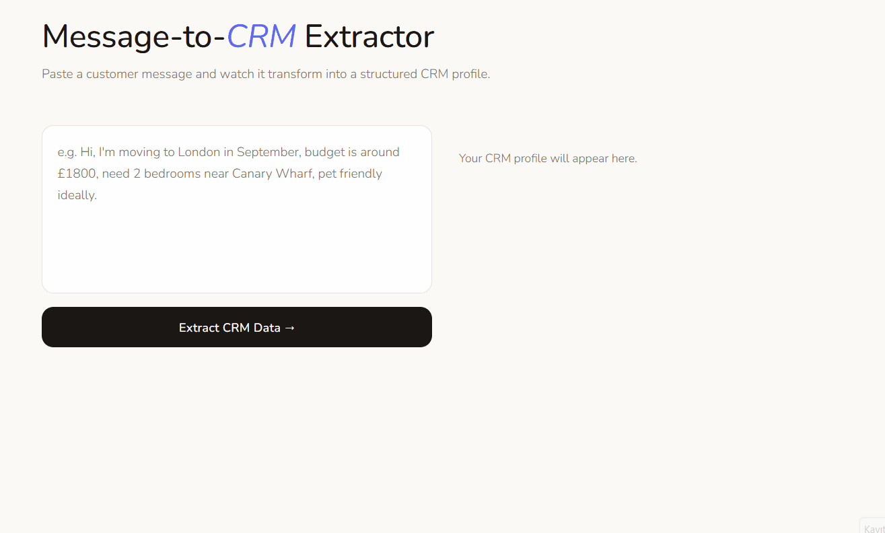

# message-to-crm-extractor

> An AI-assisted tool that converts customer property messages into structured CRM fields.  
> Built as a mini case study for Iceberg Digital.

🔗 [Live Demo](https://gozdekcr.github.io/message-to-crm-extractor/demo)

---

## Problem Statement

UK estate agents receive customer questions across WhatsApp, email, and property portals. Many of these messages contain actionable CRM data like budget, location, move-in date, bedroom count, pet or furnishing preferences but extracting and logging that data manually is slow and error-prone.

Assumptions:
- ~30 incoming customer messages per day
- ~30% contain CRM-relevant lead information
- ~2 minutes manual CRM entry per relevant message

This results in:
- ~18 minutes of repetitive admin work daily
- 75+ hours annually spent on manual CRM data entry

Manual entry also increases the risk of:
- incomplete customer profiles
- inconsistent data formatting
- missed follow-ups

## Solution

This tool extracts structured CRM data from raw customer messages: budget, location, move date, bedrooms, and pet/furnishing preferences.

- **CRM relevance filter** : ignores non-actionable messages like "Thanks, Saturday works!"
- **Confidence flags** : distinguishes exact, approximate, hard_limit, and flexible values
- **Missing field detection** : identifies missing customer information
- **Ambiguity preservation** : "around £1800" stays approximate, not forced into a hard number

> The goal is not to replace the agent. It is to reduce repetitive CRM admin so agents can focus on customer communication.

## How a User Would Use This

1. Customer message arrives
2. System checks CRM relevance
3. Extracts structured fields
4. Flags ambiguity / missing fields
5. Agent reviews output
6. CRM is updated

## Data Requirements
 
**Input:**
- Raw customer message text (unstructured, natural language)

**Extracted fields:**
| Field | Example input | Extracted value |
|-------|--------------|-----------------|
| Budget | "around £1800 a month" | `£1800 / approximate` |
| Budget ceiling | "max £2000" | `£2000 / hard_limit` |
| Location | "Canary Wharf or Greenwich" | `["Canary Wharf", "Greenwich"] / flexible` |
| Bedrooms | "2 bedrooms" | `2 / exact` |
| Move date | "maybe October" | `October / approximate` |
| Pets | "we have a dog" | `yes / exact` |
| Furnished | "prefer unfurnished" | `unfurnished / exact` |
 
**No external data sources are required** for the current implementation. Future versions would integrate with the CRM API to push extracted fields directly into the customer record.
 
---

## Technical Approach

**Tech Stack**
- HTML, CSS, JavaScript
- No backend or external dependencies

> I chose a rule-based approach so the agent can see which field was pulled and why. Transparency was important for building trust during early adoption.

**Extraction Logic**
- Regex patterns for budget, bedrooms, and dates
- Rule-based matching for London areas and keywords (pets, furnishing)
- Ambiguity keywords ("around", "maybe", "ideally", "flexible") trigger `approximate` or `flexible` confidence flags rather than forcing exact values
- Word-based bedroom extraction: handles both numeric ("2 bedrooms") and written ("two bedrooms") inputs

**Limitation:**
- Rule-based extraction does not work on irregular sentence construction. A client who writes "*Budget’s not huge, somewhere around two grand*" won’t get captured. So LLM upgrade is a need.

**Python Version** 
- A standalone Python implementation is also included in `demo/extractor.py` , using the same extraction logic for backend integration experiments.

## AI Usage

AI tools were used throughout the ideation and implementation process.

**ChatGPT** and **Claude** were used to:
- Research common pain points in UK estate agency workflows  
- Generate and refine the README structure and documentation
- Shape solution design and scope decisions
- Iterate on confidence flag definitions and user flow

In all instances, I have been guiding the prompts,evaluating the outputs, and making deliberate decisions on what to include, modify, or exclude. The logic that went into the design of this product,in terms of the problem statement, the confidence flag, and the risk assessment, was developed through iteration.

I also tested the extraction logic manually using sample messages. During testing, I found a bug where "maybe" was incorrectly parsed as the month "May". I then debugged the regex pattern and fixed the issue.

## Risks & Limitations

- **Incorrect extraction** : rule-based patterns may fail on unusual or informal messages. "maybe October" parsed as month "May" *(actual bug found and fixed)*
- **Ambiguous values** : phrases like "around £1800" or "maybe October" are difficult to interpret exactly.
- **Missing information** : not all customer details are available in a single message. Message mentions budget but not location. Missing field detection tells the agent what to ask next
- **User dependency** : the final CRM update still depends on agent review and approval.
- **Multi-property inquiry** : "Looking for a 2-bed for myself and a 1-bed for my parents" cannot be handled. This would need multi-entity extraction logic

## Success Metrics

- **Efficiency** : reduce manual CRM entry time from ~2 minutes to under 30 seconds per message
- **Completeness** : 70%+ of CRM fields auto-filled from the original message
- **Accuracy** : less than 10% of extracted fields require manual correction by the agent

## What I'd Build Next

1. **LLM integration** : improve extraction for more informal and complex customer messages.
2. **Multi-turn support** : update CRM fields across multiple customer messages instead of a single input.
3. **CRM integration** : connect the extractor directly to CRM systems for automatic field updates.
4. **More channel support** : support additional platforms such as WhatsApp Business API and SMS.
